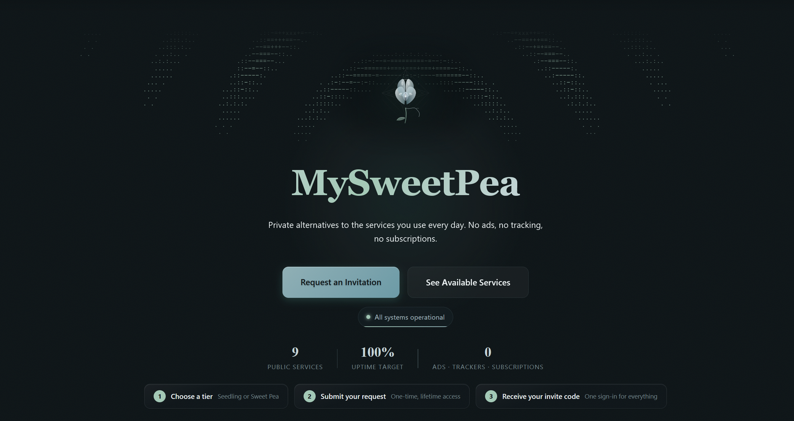
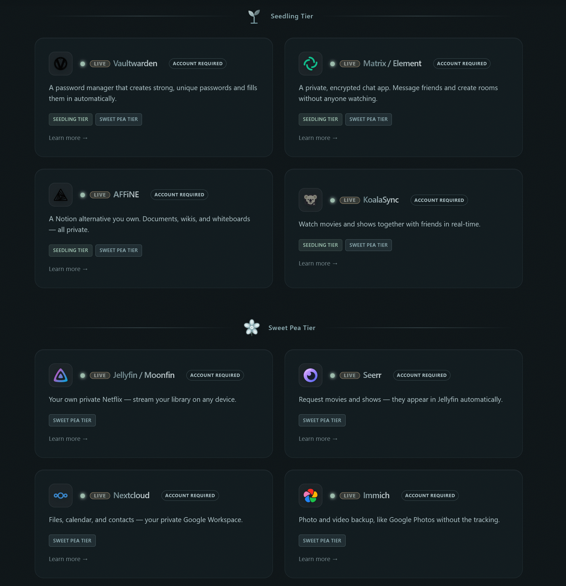

# MySweetPea Website

The public face of **MySweetPea** — a privacy-first, self-hosted, community-funded
service platform. This repo contains the marketing and signup site: plain
HTML/CSS/JS with no framework and no build step, served as static files through
a Cloudflare Worker — plus a small email auto-reply worker.

**Live:** https://mysweetpea.cc · **Status:** https://status.mysweetpea.cc
**Infrastructure:** https://github.com/mysweetpea/homelab-k8s
**Self-host the stack:** [homelab-k8s/installer](https://github.com/mysweetpea/homelab-k8s/tree/main/installer)

---

## What is this?

MySweetPea is a small community platform: self-hosted alternatives to everyday
cloud services (password manager, media, files, photos, notes, AI chat, private
search, private chat), funded by one-time contributions instead of
subscriptions or ads.

This repository holds the **website** — landing page, service catalog, pricing,
signup + invite flow, status page, and support pages. The actual services run
on a separate Kubernetes cluster managed in
[homelab-k8s](https://github.com/mysweetpea/homelab-k8s) (which includes a
[self-hosting installer](https://github.com/mysweetpea/homelab-k8s/tree/main/installer)
if you want to run the stack yourself).

---

## Why this architecture?

The site is deliberately boring in the best way:

- **No framework, no build step** — plain HTML/CSS/JS. Pages are fast, the
  bundle is tiny, and there is no toolchain to maintain or break.
- **Static-first** — static assets served by a Cloudflare Worker. Dynamic
  features (form submissions, invite-code validation, live status) are handled
  by webhooks to an n8n automation backend, not server code in this repo.
- **Security by construction** — a strict Content-Security-Policy with
  per-request nonces, hardened headers on every response, and no third-party
  scripts or trackers anywhere.
- **Invite-only private area** — a private "garden" section is fully denied to
  search engines (`robots.txt` + `noindex`/`nofollow`/`noarchive`).

The result: a site that is fast, cheap to run, easy to audit, and hard to break.

---

## Repo layout

```
workers/
├── site/                  # The website (Cloudflare Worker + static assets)
│   ├── index.html         # Landing page
│   ├── services.html      # Live service catalog
│   ├── pricing.html       # Tiers, services grid, per-service modals, FAQ
│   ├── form.html          # Get Access ($5 donation) + Redeem Invite Code
│   ├── redeem.html        # Invite-code redemption
│   ├── suggest.html       # Service suggestion form
│   ├── support.html       # Anonymous crypto donation page
│   ├── about.html         # Mission, self-hosting rationale, costs, FOSS
│   ├── status.html        # Live status + incidents (Uptime Kuma + n8n)
│   ├── changelog.html     # GitHub commits feed (portfolio + homelab-k8s)
│   ├── contact.html       # Contact + "before you write" checklist
│   ├── success.html       # Confirmation (?type=donation|redeem|...)
│   ├── error.html, 404.html
│   ├── manifest.json      # PWA manifest (installable, shortcuts, maskable icon)
│   ├── sw.js              # Service worker (stale-while-revalidate, v27)
│   ├── _partials/         # Shared nav + footer includes (fetched at runtime)
│   ├── src/index.js       # Worker: CSP nonces, security headers, canonical/
│   │                      #   JSON-LD injection, 404, /api/commits proxy
│   ├── assets/            # css/ js/ icons/ — shared theme + page packs
│   ├── DEPLOY.md          # Deploy notes
│   ├── fetch-icons.sh     # Icon refresh helper
│   └── wrangler.jsonc     # Worker config (routes, assets)
└── email-auto-reply/      # Cloudflare Email Worker: auto-acks support mail
    ├── src/index.js       #   uses send_email binding — no server involved
    └── wrangler.toml
docs/screenshots/          # README screenshots
```

---

## Stack

| Layer | Tech |
|-------|------|
| Hosting | Cloudflare Workers + Workers Assets |
| Frontend | Vanilla HTML / CSS / JS (no framework, no build step) |
| Fonts | Self-hosted Inter + Fraunces (variable, `font-display: swap`) |
| PWA | `manifest.json` + service worker (`sw.js`, v27) |
| Backend | n8n webhooks at `https://subscribe.mysweetpea.cc/webhook/*` |
| Status | Uptime Kuma public page at `https://status.mysweetpea.cc` |
| Email | Cloudflare Email Worker (auto-reply) |

---

## Screenshots

| | |
|---|---|
|  |  |

---

## How it works

### Static pages, dynamic features

The site is static, but several pages POST to webhooks at
`https://subscribe.mysweetpea.cc/webhook`:

| Page | Endpoint | Purpose |
|------|----------|---------|
| form.html | `/webhook/donation-request` | $5 donation access request |
| form.html | `/webhook/check-code` | Live invite-code validation |
| form.html | `/webhook/redeem-code` | Account creation from invite |
| suggest.html | `/webhook/suggest` | Service suggestion submission |
| status.html | `/webhook/incidents` (GET) | Active incidents feed |

Expected responses are JSON: `{ "ok": true }` on success, or
`{ "ok": false, "msg": "..." }` on failure (msg is shown on the button).

After successful submissions the user is redirected to
`/success.html?type=donation`, `/success.html?type=redeem`, or
`/success.html?type=sweetpea-request`; the success page reads the `type`
param and shows the appropriate message and next-steps list.

### Email auto-reply worker

`workers/email-auto-reply` acknowledges inbound mail to the support address
using Cloudflare's `send_email` binding — a reply goes out with zero servers.
See [`workers/email-auto-reply/README.md`](workers/email-auto-reply/README.md).

---

## Security

The Cloudflare Worker (`workers/site/src/index.js`) enforces a **strict
Content-Security-Policy** with **per-request nonces**:

- `script-src 'self' 'nonce-<random>'` — no `unsafe-inline` for scripts
- `style-src 'self' 'unsafe-inline'` — styles use `unsafe-inline` **without** a
  nonce (per CSP spec, `unsafe-inline` is ignored when a nonce is present in
  the same source list, so the two must not be mixed)
- `object-src 'none'`, `base-uri 'self'`, `form-action 'self' https://subscribe.mysweetpea.cc`
- `frame-ancestors 'none'`, `upgrade-insecure-requests`

Additional headers set on every response:

- `X-Content-Type-Options: nosniff`
- `X-Frame-Options: DENY`
- `Referrer-Policy: strict-origin-when-cross-origin`
- `Permissions-Policy` (camera/mic/geolocation/payment/usb disabled)
- `Strict-Transport-Security` (2-year, preload)
- `Cross-Origin-Opener-Policy: same-origin`
- `Cross-Origin-Embedder-Policy: credentialless`
- `Cross-Origin-Resource-Policy: same-origin`

The Worker also:

- Injects a per-page `<link rel="canonical">` + JSON-LD `Organization` schema
- Serves `404.html` for unknown HTML routes
- Proxies `/api/commits` to GitHub (token stays server-side, 5-min cache)

> **Note:** HTML responses are **dynamic** (per-request nonces) — the Worker
> sets `Cache-Control: no-store` and strips `If-None-Match`/`If-Modified-Since`
> before `env.ASSETS.fetch` so edge caching never serves stale nonces. The
> Worker must be redeployed (`wrangler deploy`) after any change to
> `src/index.js`; static asset changes (HTML/CSS/JS) are served directly.

---

## Deployment

```bash
cd workers/site
wrangler deploy
```

Details in [`workers/site/DEPLOY.md`](workers/site/DEPLOY.md). The Worker
serves the directory as static assets, applies security headers, and
intercepts unknown HTML routes with `404.html`.

---

## Design system

Shared tokens live in `workers/site/assets/css/site.css`:

- `--primary` (#8FAFB5) nordic teal, `--sage` (#A3C9B6) stem sage accents
- Dark background (#0C1316) with glassmorphic cards (blur + transparency)
- `glass-text` shimmer headings, floating petals canvas, glow-on-hover cards
- Dark/light theme toggle (persisted in `localStorage`)
- Animations respect `prefers-reduced-motion`

Page-specific styles live in the shared `site.css` scoped via
`body[data-page]`.

---

## Accessibility

- Skip-to-content link and semantic landmarks on every page
- Keyboard-accessible service cards, crypto selectors, tabs, and modals
- Focus-visible outlines; decorative elements are `aria-hidden`
- `noindex` on success and 404 pages
- Command palette (Ctrl+K) for keyboard-first navigation

---

## Wallet addresses

Crypto wallet addresses live in a `WALLETS` object in the inline script of
`form.html` and `support.html`:

```js
var WALLETS = { monero: 'Coming Soon', bitcoin: 'Coming Soon' };
```

Replace both values (in both files) when real addresses are available.

---

## License / contact

Questions: support@mysweetpea.cc
Infrastructure: https://github.com/mysweetpea/homelab-k8s
This site: https://github.com/mysweetpea/portfolio
